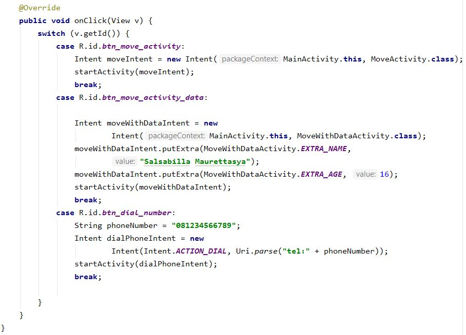

# Intent
# Tugas intent modul 9 10 11

# Modul 9
Pada modul ini digunakan untuk pindah dari satu activity ke activity lain
# Modul 10
Pada modul ini digunakan untuk pindah dari satu activity ke activity lain dengan membawa data
# Modul 11
Pada Modul ini digunakan untuk pindah ke halaman telepon

Memiliki tampilan kode sebagai berikut :

a. activity_main.xml

-code-

-design-

b. tambahkan berkas dimen.xml

c.string.xml

disini kita bisa mengisi string yang diperlukan dan disii sudah ada beberapa string yang dibutuhkan dalam modul 9 dan berikutnya

d. MainActivity.java

Baris yang tertera berfungsi untuk memperkenalkan button yang sudah ditambahkan di layout activity_main.xml dan beberapa baris untuk menambahkan event onClick pada btn dengan java

e. membuat btnMoveActivity

package name > new > activity > empty activity >Finish

ubah Activity Name : MoveActivity untuk modul 9

- activity_move.xml

hasilnya modul 9 adalah :

Pada modul ini terdapat suatu objek Intent seperti berikut :

Intent(MainActivity.this,MoveActivity.class);

this digunakan untuk kelas asal sedangkan class digunakan untuk kelas tujuan

ubah Activity Name : MoveActivityWithData untuk modul 10

- activity_move_with_data.xml

tambahkan textviewer untuk menampilkan data yang dikirimkan dari activity asal

- MoveWithDataActivity.java

hasilnya modul 10 adalah :

hasil modul 11 :

Dalam modul ini terdapat kode

Uri.parse("tel:"+phoneNumber)

"tel:" berfungsi sebagai schema sedangkan phoneNumber adalah sebuah variabel

# Salsabilla Maurettasya A
# 39 - XI RPL 3

